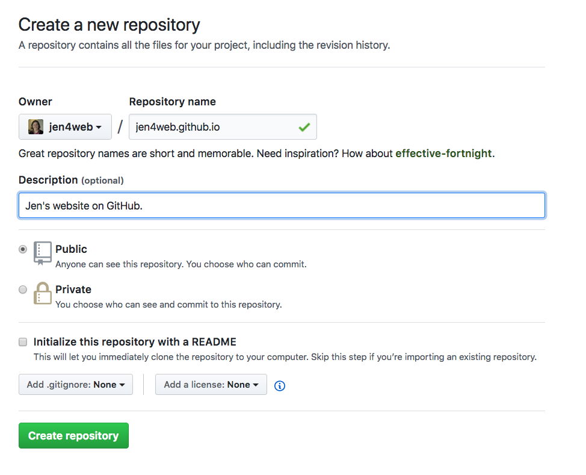
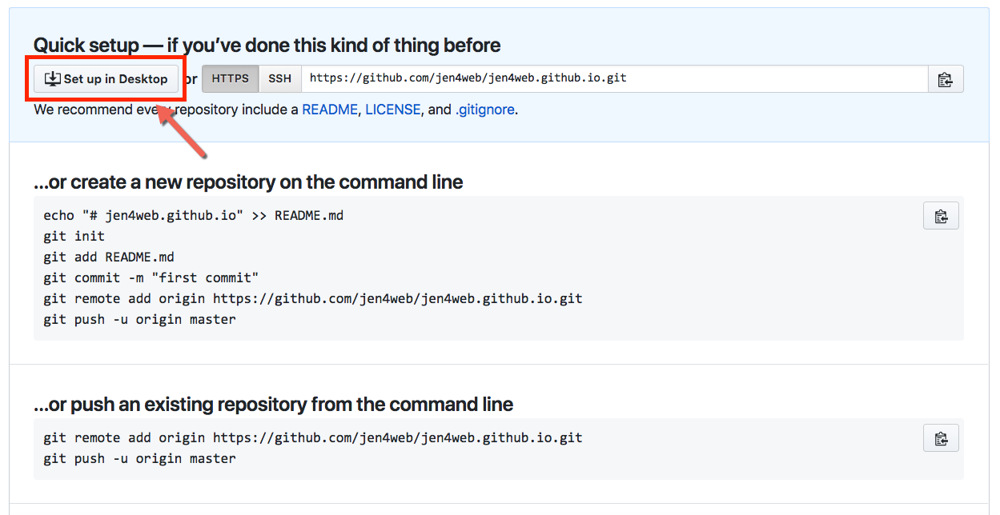
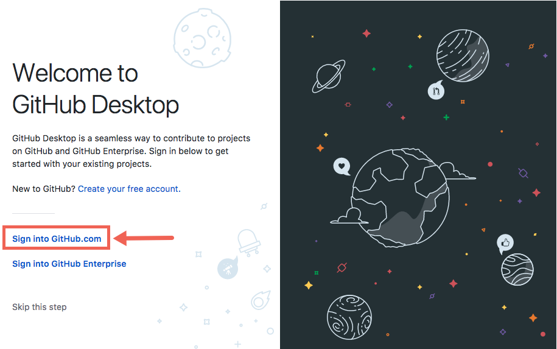
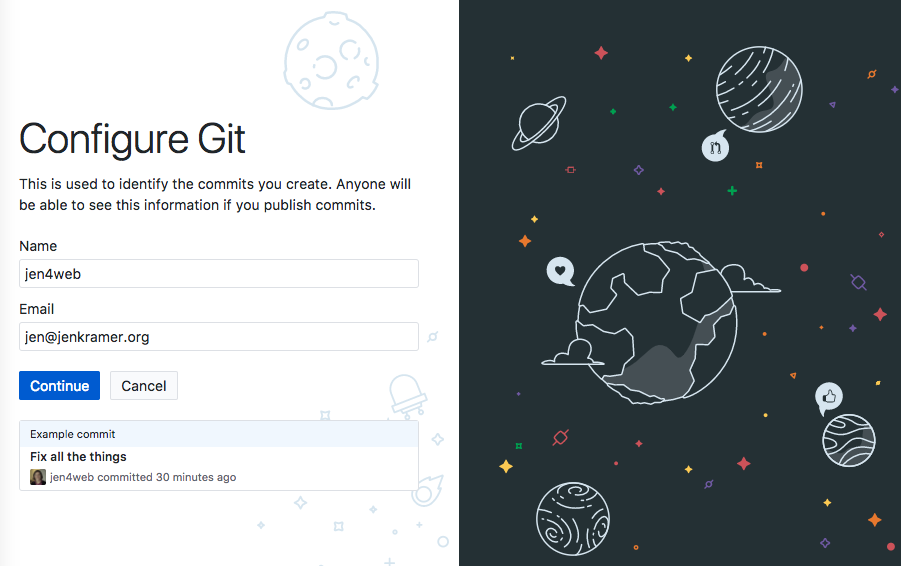
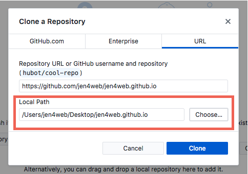
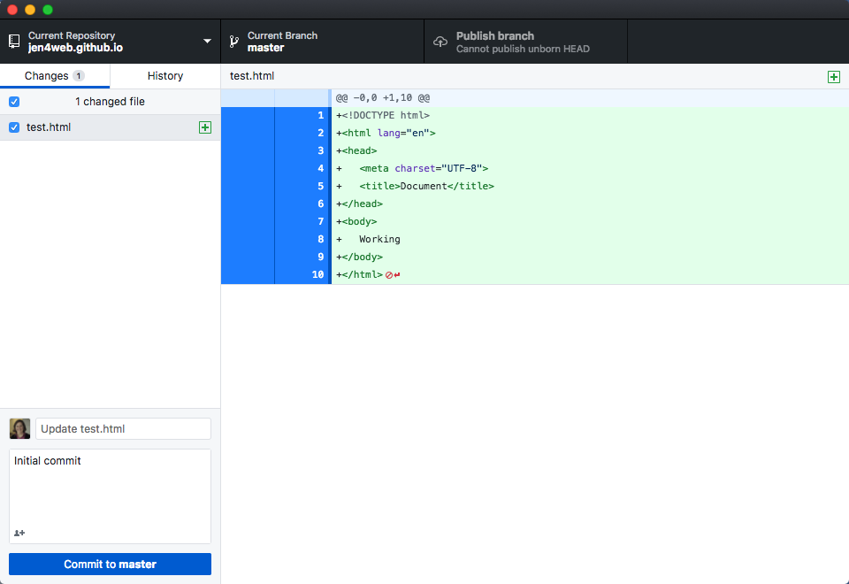

## GitHub Pages

### Getting Web Pages Online

Files are found at https://github.com/FrontendMasters/bootcamp/tree/master/static/exercises/5-github

[Download ZIP of Files](https://github.com/FrontendMasters/bootcamp/blob/master/static/exercises/5-github.zip)

### Getting web pages online

So far, the websites we've built have worked on the computer in front of us only. That's not much of a site if no one else can see it!

You will need a way to display your web pages online so the world can see them. There are many ways to accomplish this. One of the oldest ways that still works great is the following:

- **Sign up for web hosting** with a web hosting provider. (For the simple sites we're building, any web hosting provider will work!) This is also called a **server**.
- As part of the hosting signup, **purchase a domain name** for your website. (Alternatively, if you already have a domain name, **point the domain name** to your new web hosting.)
- Download a FTP program like **FileZilla** ([https://filezilla-project.org/download.php?type=client](https://filezilla-project.org/download.php?type=client)), and t**ransfer your website** from your computer to the web hosting provider's server.
- **Look at your website!**

Unfortunately, web hosting and domain names costs money, and we are just starting out, wanting to keep everything free.

Fortunately, there is another solution to getting a simple website like ours online: GitHub Pages!

You will need to follow the below instructions very carefully to get this working. I've included links to additional reading if you get lost along the way.

## 1. Sign up for GitHub

First, sign up for GitHub.

Go to [https://www.github.com](https://www.github.com) and sign up for the service.

If you already have a GitHub account, make sure you are signed in.

## 2. Download GitHub Desktop

Go to [https://desktop.github.com](https://desktop.github.com) and download the GitHub Desktop version for your computer, Mac or Windows.

Install the application on your computer.

## 3. Create a repository

A repository is a place where your files will be stored, similar to a folder or a directory.

1. Make sure you are signed into GitHub.
2. Go here: [https://github.com/new](https://github.com/new)
3. In the Repository Name field, enter your username.github.io. For example, I am `jen4web` on GitHub, so my repository name is `jen4web.github.io`. Add a description. The other settings should look like the ones below. Click the "create repository" button.

## 4. Set up the repository in GitHub Desktop

**Click the "Set up in Desktop" button in the next screen:**

Allow GitHub Desktop to open. There is an opening configuration screen. Click on "Sign into GitHub.com".

Enter your username (or email address) and password.

Configure your name and email as you wish, and click Continue. Click the finish button on the next screen, and you are good to go!

Now you are in GitHub Desktop, and the screen should be filled out for you on the URL tab. Choose the desktop for your local path. It will create a new folder for you on the desktop:

Click the "Clone" button to finish setting up GitHub Desktop.

## 5. Make sure your GitHub folder has all of the files you want to post online

Review the folder. Does it have all of your HTML, images, and CSS ready to post? If not, copy these files into the folder.

**Make sure one file — probably your home page — is called index.html.** Make sure the links to that file are correct.

Refer back to GitHub Desktop — once you've copied in your files and folders, you should see all of them listed here.

## 6. Make a commit note for each file in the lower left corner

A "commit" is the moment you upload these files and folders to GitHub. You are "committing" your changes to the repository.

Make a note for each item by clicking on the file name and writing a note in the lower left corner of the screen.

## 7. Click the "Commit to master" button and "Publish Branch" button

With notes in place, select all of your files and folders and click the blue "commit to master" button in the lower left. Then click the "publish branch" button in the black area in the upper right.

## 8. Look in your browser window

Open a new tab in your browser and go to `https://<username>.github.io` -- in my case, [https://jen4web.github.io](https://jen4web.github.io).

You should see your web page, images, and CSS styles show up on your home page

## 9. Waaaa, it didn't work!!!

What exactly "didn't work?"

- Did you keep the exact same file and folder structure that you had on your computer previously? If not, you broke the paths between files, and you'll need to fix that.
- Did all of your images and css upload? (Go to `www.github.com/<username>`, click on Repositories, and click on the repository for this exercise. Are all of the files there and in the proper places?
- Did you have a file called index.html? If not, you'll need to type in the name of that file as part of the URL. For example: [http://jen4web.github.io/about.html](http://jen4web.github.io/about.html)
- Did you follow the above instructions exactly? If you named your repository something other than `<username>.github.io`, it "won't work."

## 10. Updating files in your repository

You may want to keep making changes to your website, and you want to keep publishing those changes to your repo. To do this:

- Make all of your edits and changes in VSCode, just as you've been doing. Save your changes in the `<username>.github.io` folder.
- When you're ready to post your changes, open up GitHub Desktop, and go into the `<username>.github.io repo`.
- Make sure the "changes" tab is selected. It should show you all changed files since the last time you posted.
- Select each file individually, make a note about what changed, and click "commit to master"
- Click the button on the top right, which might now read "fetch origin" -- but it still does the same thing.
- Check to see your changes in the browser.

## References

- GitHub [http://www.github.com](http://www.github.com)
- GitHub Pages [https://pages.github.com/](https://pages.github.com/)
- How to Craft a Stand-Out Web Developer Portfolio
  [https://skillcrush.com/2016/10/31/web-developer-portfolio/](https://skillcrush.com/2016/10/31/web-developer-portfolio/)
- How to Build an Impressive Portfolio When You're New to Tech
  [https://skillcrush.com/2015/03/12/impressive-tech-portfolio/](https://skillcrush.com/2015/03/12/impressive-tech-portfolio/)

## Your Portfolio Project

When thinking about your portfolio, consider these business questions:

- Who will see it?
- What will they want to know about you?
- What questions do you need to answer?
- What value can you provide?

Then consider these technical questions:

- What is your color scheme? Branding?
- Have you made the pages look consistent across your site?
- Do all of your links work correctly?
- Does your site look good in Chrome and Firefox?

### Waaaa, it "doesn't work"!!!

Remember to use the HTML and CSS validators if things are looking odd in the browser, or if the colors in the editor seem off. That's an indicator that you've made some errors along the way. The HTML validator is great for catching errors pertaining to syntax, tag spelling, tag nesting, and applying the right attributes to a given tag. The CSS validator will find unclosed curly brackets, properties and values that don't exist, and more.

HTML validator: http://validator.w3.org/

CSS validator: http://jigsaw.w3.org/css-validator
