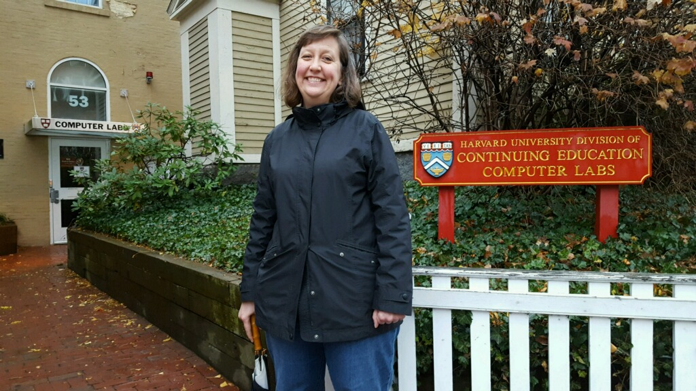

From Jen Kramer and Brian Holt, your instructors:

We are excited to teach you the basics of web development, including HTML, CSS, and some JavaScript. In this course we assume you know absolutely nothing about writing code.

Because this is a short course, we are not able to cover everything about HTML, CSS, JavaScript, and web development exhaustively. Our goal is to teach you just enough to determine whether this kind of work for you. Do you enjoy it? Is it interesting?

If so, you'll be ready to dig into all of the resources the Internet offers, learning more on your own. **Completing this course will not fully prepare you to be a professional web developer.** You will need more practice with these concepts and more education. However, this course is an excellent start towards that goal.

## Prerequisites

We do assume that you have a basic grasp of how to operate your computer: how to browse the Internet, how to operate your operating system, how to use a keyboard and mouse, etc.

We also assume you have completed the Internet Fundamentals course, a free introduction to important concepts like file management, the client and the server, and how the web works. http://www.internetfundamentals.com

## Tips to Succeed In This Course

Contrary to what many people believe, you do not have to be a wizard with math to write code. The two subjects share some overlap but also are quite different. Many artists, lawyers, historians, linguists, and others have great success learning how to code. Don't let those preconceived notions hold you back at all.

Also keep in mind that this is _hard_. Learning how to code is hard. It's similar to learning a foreign language where you have to learn a lot of small pieces of information to be able to make sense of the larger picture. It's easy to feel discouraged, especially when you feel like you _should_ get something but don't. Keep your head up and keep trying. Walk away from the problem and come back later. Try explaining your problem to someone / your dog / a [rubber ducky][rubber-duck] Seriously, it works. Say it out loud.

Never feel afraid to Google _anything_. Every programmer you know, from the top person in the field to the newest student is Googling things _constantly_. This isn't cheating; it's a skill. It's a requirement. There is so much information coming at you that cannot possibly remember it all. Copy and paste code. Look at StackOverflow. Ask dumb questions. You get better by repeatedly exposing yourself to information. Each time a bit more will sink in.

Don't try to understand every piece all at once. There are times where it's okay to just trust that something works and come back later to understand how. It's a tough balance because you do want to try to understand what's going on. We will tell you what's worth diving into and what's worth leaving for another day. You don't have to understand it all at once.

Lastly, this isn't a get-rich-quick scheme. Learning to code is hard and requires a lot of hard work. While entry-level jobs are out there, and you can get them with months of work, we guarantee you you'll have to work hard for them.

## Who Are We?

### Jen Kramer, Lecturer at Harvard University Extension School

I'm Jen Kramer. I teach the web!

For most of my 18 year career, I've been a freelancer. I lived in the backwoods of Vermont and built websites for interesting people. I ran a small web design firm in New Hampshire and built websites for interesting companies. Now I live in the Boston suburbs, and while I build fewer sites than I used to do, I do still occasionally put together sites for a good cause.

Throughout, I've also been a teacher. I taught academically: community college, undergraduates, and graduate students. I taught commercially: LinkedIn Learning/Lynda.com, Frontend Masters, osTraining, and O'Reilly, creating over 35 video training courses. I taught dozens of workshops for corporations and at conferences. I've presented at a conference every six weeks, on average, for the last ten years. And I've written 3 books -- currently working on #4.

Most of my teaching focuses on the continuum from concept for a website through coding the front end. That includes topics like user experience (UX), user interface design (UI), HTML, CSS, responsive design, content management systems like Joomla and WordPress, project management, web marketing and branding, web semantics, web analytics, and accessibility.

In all my years of teaching, my favorite audience is the beginning beginners -- in other words, people just like you. You are the most difficult audience, because concepts professionals have long taken for granted are brand new and fresh for you. Everything needs to be explained exactly. In explaining, I learn what I didn't know in enough detail before. It is here that the habits of an entire career are formed. It is here, I believe, that I can most influence the web and where it's going.

[frontend-masters]: https://frontendmasters.com/teachers/jen-kramer/
[twitter]: https://twitter.com/jen4web
[facebook]: https://www.facebook.com/webdesignjen/
[github]: https://github.com/jen4web
[linkedin]: https://www.linkedin.com/in/jen4web/
[slideshare]: https://www.slideshare.net/jen4web

### Brian Holt, Cloud Developer Advocate at Microsoft

My name is Brian Holt. I'm presently (as of writing) a cloud developer advocate at Microsoft. That means I talk to people why I think Azure is a pretty cool place to deploy your code. I write a lot of code demos and help with some open source libraries. I've taught a lot of lessons on [Frontend Masters][frontend-masters] and used to be on the frontend development podcast [Front End Happy Hour][fehh]. Previous to that, I was a senior or staff JavaScript and Node engineer at LinkedIn, Netflix, Reddit, Needle, KSL.com, and NuSkin.

My biggest passions in life are people and experiences. I hope by going through this course that it can improve your life in some meaningful way and that you in turn can improve someone else's life. My beautiful wife and I live in Seattle, Washington in the United States of America with our cute little Havanese dog Luna. I'd almost always rather be traveling and have been fortunate to see over thirty countries in the past five years.

Please catch up with me on social media, would love to chat:

- [Twitter][twitter]
- [Instagram][instagram]
- [GitHub][github]
- [LinkedIn][linkedin]

I love to teach. It's a challenging task that forces you to peel back all the knowledge you've gain so you can approach someone who lacks the same experience and terminology you have. It forces you to take amorphous concepts floating in your brain and crystalize them into solid concepts that you can describe. It forces you to acknowledge your gaps in knowledge because you'll begin to question things you know others will question. For me to ever master a concept, I have to teach it to someone else.

Unfortunately life gets in the way. These courses take dozens of hours to prepare and to get right. While I'd love to just create content all day, I have a (awesome) day job at Microsoft that demands and deserves my full attention. However I'm grateful to the team at [Frontend Masters][fem] for giving me deadlines and incentive to create these courses and then allowing and encouraging me to open source the materials. Not everyone has the money to pay for these courses which is why these materials are and will be forever open source for you to reference and share. I think the video content is pretty good too and so I'd encourage you to take a look at that on Frontend Masters too if that's in the cards for you.

[rubber-duck]: https://en.wikipedia.org/wiki/Rubber_duck_debugging
[frontend-masters]: https://frontendmasters.com/teachers/brian-holt/
[fehh]: http://frontendhappyhour.com/
[fem]: https://frontendmasters.com/
[twitter]: https://twitter.com/holtbt
[instagram]: https://www.instagram.com/briantholt/
[github]: https://github.com/btholt
[linkedin]: https://www.linkedin.com/in/btholt/

## Why was this course created?

Frontend Masters sponsored this bootcamp as a service to their community. They have long been the leader in advanced front-end web development courses, well-respected by the professional community. However, increasingly, they were contacted by beginners, attracted to the high quality of the courses, but without the background to adequately take advantage of the material.
