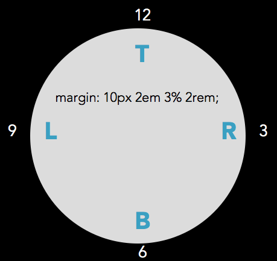
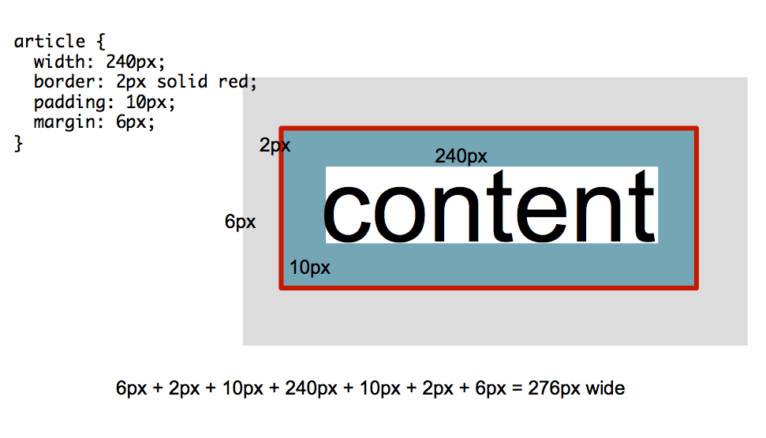
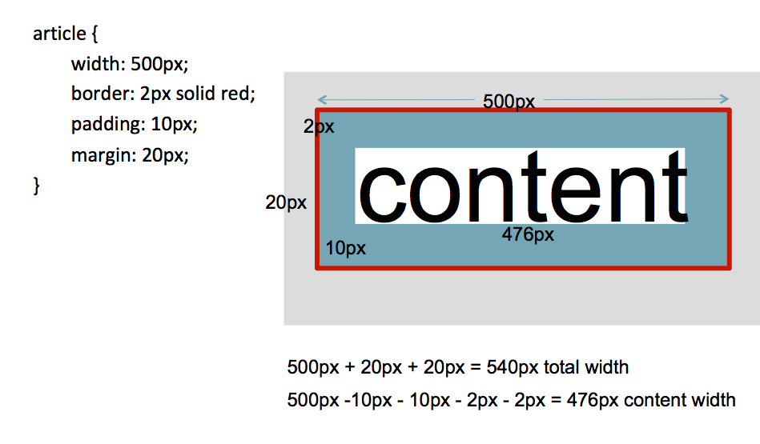

## Demo

Explore the box model, including `padding`, `border`, `margin`, `width`, and `height`, as well as the `display:inline` and `display: block` properties, using this CodePen link: https://codepen.io/jen4web/pen/JmweGL?editors=1100

CodePen end state for the box model discussion: https://codepen.io/jen4web/pen/zmVbrQ

CodePen for discussion of rem vs em units of measure: https://codepen.io/jen4web/pen/wYLOpj


## Box model properties and values

### `border`

- `border-width`
- `border-style`
- `border-color`
- `border-top`
- `border-top-width`
- `border-top-style`
- `border-top-color`

Same for `bottom`, `left`, `right`

Requires a width, style, and color to display.

Shorthand: `border: 1px solid red;`

```html
<style>
.border1 {
    border-width: 5px;
    border-style: solid;
    border-color: #c02d28;
}
</style>

<p class="border1">Lorem ipsum dolor sit amet, consectetur adipiscing elit, sed do eiusmod tempor incididunt ut labore et dolore magna aliqua.</p>
```

`Width` values: can be anything you want. Default is 3px.

`Style` values: `solid`, `dotted`, `dashed`, `double`, `groove`, `ridge`, `inset`, `outset`. Also `none`, `hidden`. Without a style, the border will not display.

`Color` values: Any color you want, written in any format you want! Default is black.

### `border-radius`

- border-bottom-left-radius
- border-bottom-right-radius
- border-top-left-radius
- border-top-right-radius

Creates rounded corners. Specify a large radius to make pills or circles.

```html
<style>
.borderradius {
    border: 2px solid #42352c;
    border-top-left-radius: 10px;
    border-top-right-radius: 10px;
}
</style>

<p class="borderradius">Lorem ipsum dolor sit amet, consectetur adipiscing elit, sed do eiusmod tempor incididunt ut labore et dolore magna aliqua.</p>
```

Size can be the same on 4 sides, or different sizes such as `border-radius: 20px;`. See "shorthand" below for understanding values.

```html
<style>
.borderradius2 {
    border: 2px solid #42352c;
    border-radius: 100px;
}
</style>


```

### `padding`

- padding-top
- padding-right
- padding-bottom
- padding-left

Padding is the distance between the content and the border. **Padding values must always be positive.**

```html
<style>
p.padding1 {
    padding: 20px;
    background-color: #d74f25;
    color: white;
}
</style>

<p class="padding1">Lorem ipsum dolor sit amet, consectetur adipiscing elit, sed do eiusmod tempor incididunt ut labore et dolore magna aliqua. Ut enim ad minim veniam, quis nostrud exercitation ullamco laboris nisi ut aliquip ex ea commodo consequat</p>
```

```html
<style>
p.padding2 {
    padding: 10px 30px;
    background-color: #d74f25;
    color: white;
}
</style>

<p class="padding2">Lorem ipsum dolor sit amet, consectetur adipiscing elit, sed do eiusmod tempor incididunt ut labore et dolore magna aliqua. Ut enim ad minim veniam, quis nostrud exercitation ullamco laboris nisi ut aliquip ex ea commodo consequat</p>
```

```html
<style>
p.padding3 {
    padding: 5% 0 20px 1rem;
    background-color: #d74f25;
    color: white;
}
</style>

<p class="padding3">Lorem ipsum dolor sit amet, consectetur adipiscing elit, sed do eiusmod tempor incididunt ut labore et dolore magna aliqua. Ut enim ad minim veniam, quis nostrud exercitation ullamco laboris nisi ut aliquip ex ea commodo consequat</p>
```

```html
<style>
p.padding4 {
    padding-left: 15px;
    background-color: #d74f25;
    color: white;
}
</style>

<p class="padding4">Lorem ipsum dolor sit amet, consectetur adipiscing elit, sed do eiusmod tempor incididunt ut labore et dolore magna aliqua. Ut enim ad minim veniam, quis nostrud exercitation ullamco laboris nisi ut aliquip ex ea commodo consequat</p>
```

See "shorthand" below for understanding values.

### `margin`

- margin-top
- margin-right
- margin-bottom
- margin-left

Margin is the area outside of the border. **Margin values may be positive or negative.**

```html
<style>
p.margin1 {
    margin: 20px;
    background-color: #d74f25;
    color: white;
}
</style>

<p class="margin1">Lorem ipsum dolor sit amet, consectetur adipiscing elit, sed do eiusmod tempor incididunt ut labore et dolore magna aliqua. Ut enim ad minim veniam, quis nostrud exercitation ullamco laboris nisi ut aliquip ex ea commodo consequat</p>
```

```html
<style>
p.margin2 {
    margin: 10px 30px;
    background-color: #d74f25;
    color: white;
}
</style>

<p class="margin2">Lorem ipsum dolor sit amet, consectetur adipiscing elit, sed do eiusmod tempor incididunt ut labore et dolore magna aliqua. Ut enim ad minim veniam, quis nostrud exercitation ullamco laboris nisi ut aliquip ex ea commodo consequat</p>
```

```html
<style>
p.margin3 {
    margin: 5% 0 20px 1rem;
    background-color: #d74f25;
    color: white;
}
</style>

<p class="margin3">Lorem ipsum dolor sit amet, consectetur adipiscing elit, sed do eiusmod tempor incididunt ut labore et dolore magna aliqua. Ut enim ad minim veniam, quis nostrud exercitation ullamco laboris nisi ut aliquip ex ea commodo consequat</p>
```

```html
<style>
p.margin4 {
    margin-left: 15px;
    background-color: #d74f25;
    color: white;
}
</style>

<p class="margin4">Lorem ipsum dolor sit amet, consectetur adipiscing elit, sed do eiusmod tempor incididunt ut labore et dolore magna aliqua. Ut enim ad minim veniam, quis nostrud exercitation ullamco laboris nisi ut aliquip ex ea commodo consequat</p>
```

See "shorthand" below for understanding values.

### `width`

The width of a particular element. In general, use relative units like `%`, `em`, `rem`, rather than `px`.

```html
<style>
p.example-width {
    width: 20%;
}
</style>

<p class="example-width">Lorem ipsum dolor sit amet, consectetur adipiscing elit, sed do eiusmod tempor incididunt ut labore et dolore magna aliqua. Ut enim ad minim veniam, quis nostrud exercitation ullamco laboris nisi ut aliquip ex ea commodo consequat</p>
```

### `height`

The height of a particular element. In general, use of height is to be avoided on content, so it can expand as needed with changes in font size or the type of content.

```html
<style>
p.example-height {
    height: 12rem;
    background-color: #d74f25;
}
</style>

<p class="example-height">Lorem ipsum dolor sit amet, consectetur adipiscing elit, sed do eiusmod tempor incididunt ut labore et dolore magna aliqua. Ut enim ad minim veniam, quis nostrud exercitation ullamco laboris nisi ut aliquip ex ea commodo consequat</p>
```

### `display`

HTML tags have two methods of display by default: block and inline. Every HTML tag is assigned one of these values.

There are other values for this property including `flex` and `inline-block`.

`display: block;`

`display: flex;`

## [Shorthand](http://css.maxdesign.com.au/selectutorial/rules_shorthand.htm)

```html
<style>
p.padding-shorthand1 {
    padding-left: 4em;
    padding-right: 2em;
    padding-top: 1em;
    padding-bottom: 3em;
}
</style>

<p class="padding-shorthand1">Lorem ipsum dolor sit amet, consectetur adipiscing elit, sed do eiusmod tempor incididunt ut labore et dolore magna aliqua. Ut enim ad minim veniam, quis nostrud exercitation ullamco laboris nisi ut aliquip ex ea commodo consequat</p>
```

Will generally be written as: TRouBLe -- top, right, bottom, left

Some people think of this as clockwise as well:

```html
<style>
p.padding-shorthand2 {
    padding: 1em 2em 3em 4em;
}
</style>

<p class="padding-shorthand2">Lorem ipsum dolor sit amet, consectetur adipiscing elit, sed do eiusmod tempor incididunt ut labore et dolore magna aliqua. Ut enim ad minim veniam, quis nostrud exercitation ullamco laboris nisi ut aliquip ex ea commodo consequat</p>
```



```
margin-top: 10px;
margin-right: 2em;
margin-bottom: 3%;
margin-left: 2rem;
```

A shorthand declaration typically contains 1-4 values. For example, the rule below will apply 5em of padding to all sides of a box:

```html
<style>
p.example-shorthand1 {
    padding: 5em;
    background-color: #d74f25;
}
</style>

<p class="example-shorthand1">Lorem ipsum dolor sit amet, consectetur adipiscing elit, sed do eiusmod tempor incididunt ut labore et dolore magna aliqua. Ut enim ad minim veniam, quis nostrud exercitation ullamco laboris nisi ut aliquip ex ea commodo consequat</p>
```

This declaration will apply 1em of padding to the top and bottom, and 5em of padding to the left and right of the box.

```html
<style>
p.example-shorthand2 {
    padding: 1em 5em;
    background-color: #d74f25;
}
</style>

<p class="example-shorthand2 ">Lorem ipsum dolor sit amet, consectetur adipiscing elit, sed do eiusmod tempor incididunt ut labore et dolore magna aliqua. Ut enim ad minim veniam, quis nostrud exercitation ullamco laboris nisi ut aliquip ex ea commodo consequat</p>
```

This declaration will apply 1em of padding to the top, 3em of padding to the left and right, and 5em to the bottom of the box. (Note: a 3-number shorthand is almost never used... maybe because no one can remember which numbers stand for what dimension!)

```html
<style>
p.example-shorthand3 {
    padding: 1em 3em 5em;
    background-color: #d74f25;
}
</style>

<p class="example-shorthand3">Lorem ipsum dolor sit amet, consectetur adipiscing elit, sed do eiusmod tempor incididunt ut labore et dolore magna aliqua. Ut enim ad minim veniam, quis nostrud exercitation ullamco laboris nisi ut aliquip ex ea commodo consequat</p>
```

This declaration will apply 1em of padding to the top, 3em of padding to the right, 5em of padding to the bottom and 7em of padding to the left of the box.

```html
<style>
p.example-shorthand4 {
    padding: 1em 3em 5em 7em;
    background-color: #d74f25;
}
</style>

<p class="example-shorthand4">Lorem ipsum dolor sit amet, consectetur adipiscing elit, sed do eiusmod tempor incididunt ut labore et dolore magna aliqua. Ut enim ad minim veniam, quis nostrud exercitation ullamco laboris nisi ut aliquip ex ea commodo consequat</p>
```

## Box model types

### Content box model

There are two box model types that you will encounter in CSS: the content box model, and the border box model.

Content box model is what is used by default by CSS. In the case of the content box model, the `width` property in CSS refers to the width of the content. To determine the total width of the box, add together the value of `width`, plus any left and/or right `padding`, `margin`, and `border` that may be present.



**If the type of box model is not declared at the top of the CSS document, you may assume you're working with the content box model.**

### Border box model

The border box model says something different about the `width` property. It says that `width` is the total width of the border, padding, and the content. Any margin present is _not_ included in the `width` property.



You must declare, in your CSS document, that you are working with the border box model.

```html
<style>
.parent {
    width: 200px;
    box-sizing: border-box;
    border: 5px solid #7c8e88;
}

.child {
    box-sizing: content-box;
    /* box-sizing: border-box; */
    border: 10px solid #d74f25;
    padding: 10px;
    width: 100%;
}
</style>

<section class="parent">
    <p>Parent element</p>
    <section class="child">
        Child element
    </section>
</section>
```

The best way to apply a consistent box model throughout a web page is do use this code as follows:

```
<style>
html {
    box-sizing: border-box;
}
*, *:before, *:after {
    box-sizing: inherit;
}
</style>
```

The first declaration sets the `<html>` tag to the border box model. However, this property is not inherited. The second declaration says for everything in the universe (`*`) and everything before it (`*:before`) and everything after it (`*:after`), inherit the border box model declaration. You can place this at the top of every CSS document you write going forward!

Read more about that formula here: https://www.paulirish.com/2012/box-sizing-border-box-ftw/

## Understanding Floats and Clears

We will use this CodePen example to explore the world of floats and clears: https://codepen.io/jen4web/pen/xymQdz?editors=1100

### `float`

Pulls the element from "normal flow" and floats it in the direction indicated. Space the element occupied is eliminated.
Values include `left`, `right`,`none`

Note: if you are floating an element other than an image, you should also specify a width.

```html
<style>
.float1 {
    float: left;
}
</style>

<p>

Lorem ipsum dolor sit amet, consectetur adipiscing elit, sed do eiusmod tempor incididunt ut labore et dolore magna aliqua. Ut enim ad minim veniam, quis nostrud exercitation ullamco laboris nisi ut aliquip ex ea commodo consequat</p>
```

### `clear`

What you must do if you float! Clear re-establishes normal flow.
Values include `left`, `right`, `both`

```html
<style>
p.p-clear-right {
    float: left;
    height: 75px;
    border: 5px solid #7c8e88;
    width: 35%;
    clear: none;
}
p.p-clear-left {
    float: right;
    width: 65%;
    border: 4px solid #d74f25;
    clear: none;
}
p.p-footer {
    border: 4px solid #d74f25;
    width: 100%;
    clear: none;
    /* clear: both; */
}
</style>

<p class="p-clear-right">Lorem ipsum </p>
<p class="p-clear-left">Ut enim ad minim veniam</p>
<p class="p-footer">This is a footer. Ut enim ad minim veniam, quis nostrud exercitation ullamco laboris nisi ut aliquip ex ea commodo consequat</p>
```

There are other methods to clear as well. A popular one is to self-clear the parent using this formula:

```html
<style>
.group:after {
    content: "";
    display: table;
    /* clear: both; */
}
p.p-float5 {
    float: left;
    width: 66%;
    height: 75px;
    border: 5px solid #7c8e88;
    clear: none;
}
p.p-noclear {
    clear: none;
}

</style>

<section class="group">
<p class="p-float5">Lorem ipsum </p>
<p class="p-float5">Lorem ipsum </p>
<p class="p-float5">Lorem ipsum </p>
</section>
<p class="p-noclear">Ut enim ad minim veniam, quis nostrud exercitation ullamco laboris nisi ut aliquip ex ea commodo consequat</p>
```

Read more about clearing: https://css-tricks.com/snippets/css/clear-fix/

## Styling navigation bars in a horizontal and vertical direction

We'll work with CodePen for learning how to style navigation bars using all of the box model information we've covered so far.

For our vertical navigation bar, we'll turn off the bullets in the list, then style the list of links to look like buttons.

Vertical navigation bars start for lecture: https://codepen.io/jen4web/pen/xymQoM

Vertical navigation bars finish state: https://codepen.io/jen4web/pen/ZqdZeW

For our horizontal navigation bar, we'll make our unordered list go vertically on the page using `display: inline-block;`.

Horizontal navigation bars start for lecture: https://codepen.io/jen4web/pen/OBrrLR

Horizontal navigation bars finish state: https://codepen.io/jen4web/pen/oarRXQ

## Introducing Flexbox

Flexbox is a new way of managing the layout of web pages. It has recently become extremely popular and useful. Flexbox itself would take an entire day to explain well, so we are going to focus on just a few properties you'll need to make simple layouts. You can find much more about Flexbox at Frontend Masters: https://frontendmasters.com/courses/css-grids-flexbox/

To make flexbox work, you need two HTML tags that have a parent-child relationship. These are called the _flex container_ (parent) and the _flex item_ (child). Example:

```html
<style>
div.parent-flex {
    border: 5px solid #7c8e88;
    padding: 10px;
}
p.child-flex {
    border: 5px solid #7c8e88;
    padding: 10px;
}
</style>

<div class="parent-flex">
    <p class="child-flex">The paragraph is the child, or flex item, while the div is the parent, or flex container.</p>
</div>
```

To get started with flexbox, set the display property on the flex container: `display: flex;`

### Flex container properties

`flex-flow` will set up the direction of flexbox and some behaviors. There are two values specified for `flex-flow`. The first is the `flex-direction`. This is typically set to `row` or `column`.

The second value is the `flex-wrap`. This specifies whether the boxes should wrap to another row/column or not. Typical values are `wrap` or `nowrap`.

One other property that might be useful is `justify-content`. Do you want all of the boxes pushed to the beginning of the row (`flex-start`), the end of the row (`flex-end`), centered (`center`), or have any extra space distributed across the row (`space-around`)?

```html
<style>
div.parent-flex2 {
	display: flex;
	flex-flow: row nowrap;
	justify-content: space-around;
	border: 5px solid #42352c;
}
p.child-flex2 {
	border: 5px solid #c02d28;
	background-color: #e7e6d2;
}
</style>

<div class="parent-flex2">
    <p class="child-flex2">1</p>
    <p class="child-flex2">2</p>
    <p class="child-flex2">3</p>
    <p class="child-flex2">4</p>
    <p class="child-flex2">5</p>
    <p class="child-flex2">6</p>
</div>
```

### Flex item properties

By default in flexbox, if you decide to set up a row of boxes, all boxes will have the same width by default. So if you decide to have a row (a flex container) containing 4 children (or flex items), each child will be 25% wide.

If you don't want to use the default width, then assign the `flex-basis` property to the flex item. This number should be a percentage, if you choose to use it.

```html
<style>
div.parent-flex3 {
	display: flex;
	flex-flow: row nowrap;
	justify-content: space-around;
	border: 5px solid #42352c;
}
p.child-flex3 {
	flex-basis: 10%;
	border: 5px solid #c02d28;
	background-color: #e7e6d2;
}
</style>

<div class="parent-flex3">
    <p class="child-flex3">1</p>
    <p class="child-flex3">2</p>
    <p class="child-flex3">3</p>
    <p class="child-flex3">4</p>
    <p class="child-flex3">5</p>
    <p class="child-flex3">6</p>
</div>
```

**Why not `width`?**

The `width` property means to make something a certain width -- period! If it's 25%, it will never be 24.99% or 25.01%.

The `flex-basis` property, however, is more flexible. It says to make the width 25%, but a little more or less than that is OK too.

## References

### Box Model

- The CSS Box Model: [https://css-tricks.com/the-css-box-model/](https://css-tricks.com/the-css-box-model/)
- CSS box-sizing property: [https://developer.mozilla.org/en-US/docs/Web/CSS/box-sizing](https://developer.mozilla.org/en-US/docs/Web/CSS/box-sizing)
- Paul Irish on border-box: [https://www.paulirish.com/2012/box-sizing-border-box-ftw/](https://www.paulirish.com/2012/box-sizing-border-box-ftw/)

### Understanding Floats and Clears

- All About Floats: https://css-tricks.com/all-about-floats/
- Floatutorial: http://css.maxdesign.com.au/floatutorial/
- How Floating Works: https://bitsofco.de/how-floating-works/
- The Clearfix: https://css-tricks.com/snippets/css/clear-fix/

### Block level vs. inline elements; inline-block

- List of block-level elements: [https://developer.mozilla.org/en-US/docs/Web/HTML/Block-level_elements](https://developer.mozilla.org/en-US/docs/Web/HTML/Block-level_elements)
- List of inline elements: [https://developer.mozilla.org/en-US/docs/Web/HTML/Inline_elements](https://developer.mozilla.org/en-US/docs/Web/HTML/Inline_elements)
- Should you use inline-blocks as a substitute for floats? [http://vanseodesign.com/css/inline-blocks/](http://vanseodesign.com/css/inline-blocks/)

### Interneting is Hard

- The Box Model [https://internetingishard.com/html-and-css/css-box-model/](https://internetingishard.com/html-and-css/css-box-model/)
- Floats [https://internetingishard.com/html-and-css/floats/](https://internetingishard.com/html-and-css/floats/)

### Flexbox References

- Flexbox Froggy, a game for learning flexbox http://flexboxfroggy.com/
- Flexbox Defense, another Flexbox game http://www.flexboxdefense.com/
- A complete guide to Flexbox https://css-tricks.com/snippets/css/a-guide-to-flexbox/
- MDN CSS Flexible Box Layout https://developer.mozilla.org/en-US/docs/Web/CSS/CSS_Flexible_Box_Layout
- Almost complete guide to flexbox (without flexbox) https://kyusuf.com/post/almost-complete-guide-to-flexbox-without-flexbox

## Exercises

### Layout Lesson Files

Files on Github https://github.com/FrontendMasters/bootcamp/tree/master/static/exercises/3-layout

<a href="https://github.com/FrontendMasters/bootcamp/tree/master/static/exercises/3-layout.zip" download>Download ZIP of Files</a>

### Waaaa, it "doesn't work"!!!

Remember to use the HTML and CSS validators if things are looking odd in the browser, or if the colors in the editor seem off. That's an indicator that you've made some errors along the way. The HTML validator is great for catching errors pertaining to syntax, tag spelling, tag nesting, and applying the right attributes to a given tag. The CSS validator will find unclosed curly brackets, properties and values that don't exist, and more.

HTML validator: http://validator.w3.org/

CSS validator: http://jigsaw.w3.org/css-validator

### Code a Blog Page

I've given you some images and a picture of a web page layout. You have everything you need to lay this page out as a blog page. Can you figure out how to code this? To complete the layout, you will need:

- Think about borders, margin, and padding to make the page pretty.
- Think about horizontal nav bars for styling the top navigation. How about the bottom alien social media links?
- Consider floats for arranging images and text.
- Consider flexbox for making the header work correctly.

Work on this first, and ask questions in Slack. I'll address questions in the afternoon.

Starting HTML, CSS, and images are here: https://github.com/FrontendMasters/bootcamp/tree/master/static/exercises/3-layout/blog-begin

### Box Model Worksheets

I've given you some worksheets that have you calculate the width of the content and the total width of the area, based on either the content box model or the border box model. Work through the math and check your answers, provided separately. Ask questions if you have them!

Worksheets found at:
https://github.com/FrontendMasters/bootcamp/tree/master/static/exercises/3-layout/boxmodel

### Finish the book chapter

Once again, visit your book chapter. Choose some images and include them, floating them in place. (Don't forget to clear!) Consider including some quotes, or navigation to subheads.

### Additional CSS practice

If you finish early, and/or you want some more practice, work through the following sections of exercises at W3Schools:
https://www.w3schools.com/css/exercise.asp

- CSS Border
- CSS Margin
- CSS Padding
- CSS Height/Width
- CSS Box Model

### On Your Own

Finally, finish the styling of your about and hobby web pages.

Create a navigation bar with appropriate styling to link the pages together. Link your book excerpt page to this site as well.

Create columns on your page, with main content and a side bar.

In the side bar, feature favorite photos, favorite quotes, links to favorite websites, or other content that supplements the main message of the web page.
