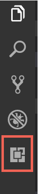
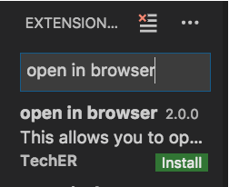
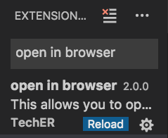
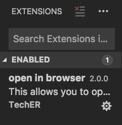

## 1. Go Through Internet Fundamentals

In order to make sure you have the skills you’ll need to follow along with the Bootcamp, you'll need to take the FREE [Internet Fundamentals course](https://internetfundamentals.com).

## 2. Install Visual Studio Code (VSCode)

You should install [VSCode](https://code.visualstudio.com) (Visual Studio Code) on your computer, as
this was part of the Internet Fundamentals course:
www.internetfundamentals.com

To this, we will add an extension.

1\. Open VSCode. On the left side of the window, click on the very last
icon:

2\. In the Search box, type in **Open in Browser** and hit return. You
should see a list of a bunch of extensions called Open in Browser.

3\. The very first one, or one near the top of the list, should be the
version from TechER. Click the green Install button.

Once installed, this will change to a blue Reload button. Click that,
and the extension will be installed.

The extension is installed when your screen looks like this:

